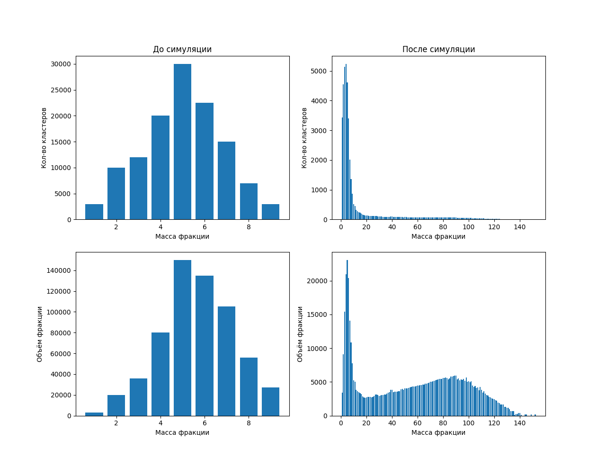

# MathModeling



## Зависимости:

Пакет           | Установка
-------------   | -------------|
cmake           | https://cmake.org/
python3         | https://www.python.org/
matplotlib      | pip install matplotlib


## Сборка:
```
1.  git clone https://github.com/artem256code/MathModeling.git
2.  mkdir build
3.  cd build
4.  cmake ..
5.  Собрать проект:
    5.1 make (для Linux)
    5.2 Открыть вашу C++ IDE и собрать проект оттуда (для Windows)
6.  Убедится что бинарник лежит рядом с "input.txt" (если нет - переместить его туда) :D
```

## Запуск

```
1.  Заполнить "input.txt" фракциями (масса кол-во) 
2.  Запустить "MathModeling" и ввести начальные данные:
    V       - объём пространства
    M       - объём вещества
    Y       - вероятносто\временной коэф.
    N       - кол-во прогонов
    a, b    - коэф. для распада
    ka, kb  - кол-во кластеров создаваемых при распаде массы 'a'
    После этого произойдёт симуляция и её результат запишется в файл "out.txt"
4.  Построить гистрограммы: 
    4.1 python3 graphics.py (для Linux)
    4.2 python  graphics.py (для Windows)
```